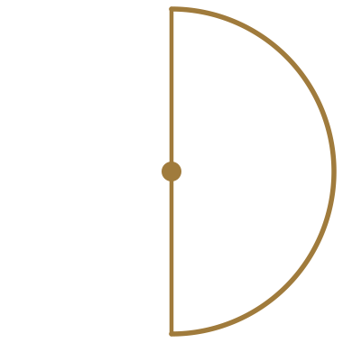

  

  <h1>Demi.Build</h1>

  
<strong>An AI atelier for game developers.</strong>

---

Game development got expensive. The studios that knew how to make weird, ambitious games are laying off the people who knew how to make them. Meanwhile, generative AI is finally good enough to carry the long tail of content (the hundredth NPC bark, the secondary quest line, the tertiary item tooltip) that drains schedules without showing up in reviews.

Demi is an **atelier**: a small set of opinionated tools, a small team of skilled humans, and AI doing the load-bearing tedium underneath. Designers focus on the gameplay and the stories they care about. The world conforms around their choices and stays internally consistent.

The goal is to make it feasible for a small team, or a single displaced dev, to ship the kind of strange, hand-crafted, ambitious games that defined the early 2000s, at modern scope and on modern hardware.

## What we're building

**[Canon](https://github.com/Demi-Build/canon-ai).** An opinionated Python orchestration layer for AI-driven primitive development. World bibles, skeleton-driven generation, and validation pipelines that keep the fifth dragon from contradicting the first. Use it with or without the rest of our stack. Open source.

**[Cradle](https://github.com/Demi-Build/cradle).** A developer interface for auditing, editing, and rapidly building out primitives, quest lines, and world bibles for AI-orchestrated games. Think Inky meets RPG Maker meets an agentic co-pilot. Reads Canon output natively, and works on hand-authored content too. Open source.

**Games.** We ship them. MazeWorld was the proof-of-concept that grew into Canon. More are on the way.

## Three things at once

**A game studio**, releasing our own titles.

**A research org**, pressing on the boundaries of generative AI for game intelligence, rapid primitive development, and AI co-working. We're also working toward better small models for game dev specifically: story writing, primitive generation, world-coherence reasoning.

**A tools org**, open-sourcing the parts that should be infrastructure and selling the parts that should be products.

## Where we're going

Beyond primitives, we're working toward content-bounded generative gameplay on real consoles. Diffusion models, liquid networks, and downscaled world-model architectures running alongside modern graphics and physics engines, all of it informed by the same world bible the game was built on. ML, diffusion, and LLMs woven through the entire game stack.

Tech-agnostic by design. Canon and Cradle produce primitives that plug into existing engines.

## Status

Early. Building in the open. Pre-website, pre-launch on most things. Repos are public. Cradle just shipped v0.1, Canon is getting cleaned up for its first public release.

## Follow along

- **Repos:** [canon-ai](https://github.com/Demi-Build/canon-ai) · [cradle V0.1.0](https://github.com/Demi-Build/cradle) 
- **Website:** coming soon
- **Contact:** wolfgangjblack@gmail.com
